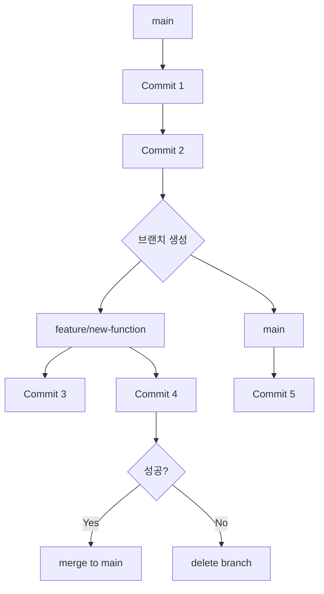
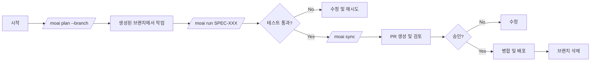

# Git 브랜치 전략과 MoAI 통합 가이드

## 목차

1. [개요](#개요)
2. [필수 개념](#필수-개념)
3. [기본 브랜치 워크플로우](#기본-브랜치-워크플로우)
4. [MoAI 통합 워크플로우](#moai-통합-워크플로우)
5. [실전 예시](#실전-예시)
6. [문제 해결](#문제-해결)
7. [모범 사례](#모범-사례)
8. [요약 체크리스트](#요약-체크리스트)

---

## 개요

이 가이드는 Git 브랜치를 활용하여 안전하게 새로운 기능을 개발하는 방법과 MoAI 워크플로우와 통합하는 방법을 단계별로 설명합니다.

### 목표

- ✅ 메인 코드(main)를 안정적으로 유지
- ✅ 실험적 기능을 안전하게 테스트
- ✅ 문제 발생 시 즉시 롤백
- ✅ MoAI와 연계된 효율적 개발

---

## 필수 개념

### 브랜치란 무엇인가?

브랜치는 독립된 작업 라인입니다. 나무의 가지처럼 메인 줄기(main)에서 뻗어나와 독자적으로 성장하다가, 성공하면 다시 합쳐집니다.



### 핵심 명령어

| 명령 | 설명 | 사용 시점 |
|------|------|-----------|
| `git branch` | 브랜치 목록 보기 | 현재 상태 확인 |
| `git checkout -b name` | 새 브랜치 생성 및 전환 | 새 기능 시작 |
| `git switch name` | 브랜치 전환 | 작업 브랜치 변경 |
| `git merge name` | 브랜치 병합 | 기능 완료 후 |
| `git branch -d name` | 브랜치 삭제 | 병합 완료 후 |

---

## 기본 브랜치 워크플로우

### 단계 1: 시작 전 상태 확인

```bash
# 현재 브랜치 확인
git status

# 메인 브랜치 확인
git branch

# 최신 상태로 동기화
git pull origin main
```

### 단계 2: 기능 브랜치 생성

```bash
# 브랜치 네이밍 규칙: feature/기능명
git checkout -b feature/새로운기능
```

브랜치 네이밍 규칙:
- `feature/xxx`: 새로운 기능
- `fix/xxx`: 버그 수정
- `refactor/xxx`: 코드 리팩토링
- `hotfix/xxx`: 긴급 핫픽스

### 단계 3: 개발 및 커밋

```bash
# 파일 수정 후
git add .
git commit -m "feat: 새로운 기능 구현"
```

커밋 메시지 규칙 (Conventional Commits):
- `feat`: 새로운 기능
- `fix`: 버그 수정
- `docs`: 문서 변경
- `refactor`: 코드 리팩토링
- `test`: 테스트 추가/수정

### 단계 4: 테스트 및 검증

```bash
# 테스트 실행
npm test          # Frontend
pytest           # Backend

# 코드 검사
npm run lint     # ESLint
ruff check       # Python
```

### 단계 5A: 성공 시 - 메인에 병합

```bash
# 메인 브랜치로 전환
git switch main

# 기능 브랜치 병합
git merge feature/새로운기능

# 원격에 푸시
git push origin main

# 기능 브랜치 삭제
git branch -d feature/새로운기능
```

### 단계 5B: 실패 시 - 롤백

```bash
# 메인 브랜치로 전환 (병경 사항 폐기)
git switch main

# 기능 브랜치 삭제
git branch -D feature/새로운기능

# 메인은 깨끗하게 유지됨
git status
```

---

## MoAI 통합 워크플로우

### 완전한 MoAI + Git 워크플로우



### Phase 1: Plan (계획) - 브랜치 생성

```bash
# MoAI가 브랜치를 자동으로 생성하는 옵션 사용
/moai plan --branch "사용자 인증 기능 추가"
```

MoAI가 수행하는 작업:
1. 요구사항 분석
2. `feature/user-authentication` 브랜치 자동 생성
3. SPEC 문서 작성 (`.moai/specs/SPEC-AUTH-001/`)

### Phase 2: Run (구현) - 브랜치에서 개발

```bash
# SPEC 문서가 승인되면 자동으로 해당 브랜치에서 구현 시작
/moai run SPEC-AUTH-001
```

MoAI가 수행하는 작업:
1. DDD/TDD 사이클로 구현
2. 커밋 자동화 (Conventional Commits)
3. 테스트 자동 생성 및 실행

### Phase 3: Sync (동기화) - PR 준비

```bash
# 문서 동기화 및 PR 생성 준비
/moai sync SPEC-AUTH-001
```

MoAI가 수행하는 작업:
1. API 문서 생성
2. README, CHANGELOG 업데이트
3. Pull Request 생성

### Phase 4: Merge (병합) - 완료

```bash
# 코드 리뷰 후 승인되면 병합
git checkout main
git merge feature/user-authentication
git push origin main

# 브랜치 정리
git branch -d feature/user-authentication
```

---

## 실전 예시

### 예시 1: 새로운 API 엔드포인트 추가

```bash
# 1. 메인 브랜치에서 시작
git checkout main
git pull origin main

# 2. 브랜치 생성
git checkout -b feature/user-profile-api

# 3. MoAI로 SPEC 작성
/moai plan "사용자 프로필 조회 API"

# 4. 승인 후 구현
/moai run SPEC-USER-001

# 5. 테스트 및 검증
pytest tests/unit/test_user_profile.py
pytest tests/integration/test_api.py

# 6. 문서 동기화
/moai sync SPEC-USER-001

# 7. 병합
git checkout main
git merge feature/user-profile-api
git push origin main
git branch -d feature/user-profile-api
```

### 예시 2: 실패 시 롤백

```bash
# 1. 기능 브랜치에서 작업 중
git checkout -b feature/experimental-feature

# 2. 문제 발생! 코드가 복잡해지고 테스트 실패
pytest tests/
# FAILED: 50% 통과

# 3. 롤백 결정
git checkout main

# 4. 실패한 브랜치 삭제 (강제 삭제)
git branch -D feature/experimental-feature

# 5. main은 안전함
git status
# On branch main, nothing to commit
```

### 예시 3: 병합 충돌 해결

```bash
# 1. 병합 시도
git checkout main
git merge feature/new-feature

# 2. 충돌 발생
# Auto-merging app.py
# CONFLICT (content): Merge conflict in app.py

# 3. 충돌 파일 확인
git status
# shows: both modified: app.py

# 4. 충돌 해결 (편집기로 열어서 수동 수정)
# app.py 파일에서 <<<<<<<, =======, >>>>>>> 마커 사이의 내용 정리

# 5. 해결 후 마킹
git add app.py

# 6. 병합 완료
git commit
```

---

## 문제 해결

### 문제 1: 잘못된 브랜치에서 작업

**증상:** main 브랜치에서 직접 커밋함

**해결:**
```bash
# 1. 변경사항 유지하며 새 브랜치 생성
git checkout -b feature/correct-work

# 2. main 브랜치 되돌리기
git checkout main
git reset --hard HEAD~1  # 마지막 커밋 취소
```

### 문제 2: 병합 후 문제 발견

**증상:** 병합 후 애플리케이션이 작동하지 않음

**해결:**
```bash
# 1. 병합 커밋 찾기
git log --oneline

# 2. 해당 커밋으로 되돌리기
git revert <merge-commit-hash>

# 또는 강제로 되돌리기 (위험)
git reset --hard HEAD~1
git push --force origin main  # 주의: 원격 히스토리 재작성
```

### 문제 3: 브랜치가 너무 많아짐

**증상:** 수십 개의 오래된 브랜치

**해결:**
```bash
# 1. 병합된 브랜치 확인
git branch --merged

# 2. 병합된 브랜치 일괄 삭제
git branch --merged | grep -v "main" | xargs git branch -d

# 3. 원격 브랜치도 정리
git remote prune origin
```

---

## 모범 사례

### 브랜치 네이밍 컨벤션

```
feature/  - 새로운 기능
fix/      - 버그 수정
refactor/ - 코드 리팩토링
docs/     - 문서 변경
test/     - 테스트 추가
hotfix/   - 긴급 핫픽스
release/  - 릴리스 준비
```

예시:
- `feature/oauth-login`
- `fix/memory-leak`
- `refactor/user-service`
- `hotfix/security-patch`

### 커밋 메시지 컨벤션

```
<type>(<scope>): <subject>

<body>

<footer>
```

예시:
```
feat(auth): add OAuth2 login support

Implement Google and GitHub OAuth2 providers.
Users can now login using their social accounts.

Closes #123
```

### 브랜치 보호 규칙 (GitHub/GitLab)

1. **main 브랜치 직접 푸시 금지**
2. **PR 필수**: 모든 병합은 Pull Request 통해
3. **CI 통과 필수**: 테스트 통과 후 병합 가능
4. **코드 리뷰 필수**: 최소 1명 승인 필요

---

## 요약 체크리스트

### 개발 시작 전

- [ ] 메인 브랜치가 최신 상태인가? (`git pull`)
- [ ] 브랜치 네이밍 규칙을 따르는가? (`feature/xxx`)
- [ ] 작업할 브랜치가 제대로 생성되었는가? (`git branch`)

### 개발 중

- [ ] 기능 브랜치에서 작업 중인가? (`git status`)
- [ ] 커밋 메시지가 명확한가? (Conventional Commits)
- [ ] 테스트가 통과하는가? (`pytest`, `npm test`)

### 병합 전

- [ ] 모든 테스트 통과?
- [ ] 코드 리뷰 완료?
- [ ] 문서 업데이트 완료?

### 병합 후

- [ ] main 브랜치로 전환?
- [ ] 병합 완료 및 원격 푸시?
- [ ] 기능 브랜치 삭제?

---

## MoAI 활용 팁

### 1. 브랜치 자동 생성

```bash
/moai plan --branch "기능 설명"
```

### 2. Worktree 활용 (고급)

```bash
# 독립된 작업 디렉토리 생성
/moai worktree "기능 설명"
```

Worktree는 동일한 리포지토리의 여러 브랜치를 동시에 작업할 때 유용합니다.

### 3. SPEC 중심 개발

모든 기능 개발은 SPEC 문서부터 시작하세요:

1. `/moai plan` → SPEC 작성
2. `/moai run` → 구현
3. `/moai sync` → 문서화
4. Git 병합 → 완료

---

## 부록: 빠른 참조

### 자주 쓰는 명령어

```bash
# 브랜치 생성 및 전환
git checkout -b feature/name

# 브랜치 목록
git branch -a

# 브랜치 삭제
git branch -d feature/name  # 병합된 브랜치
git branch -D feature/name  # 강제 삭제

# 병합
git merge feature/name

# 충돌 상태 확인
git status

# 충돌 해결 후 마킹
git add <file>

# 병합 취소
git merge --abort

# 마지막 커밋 수정
git commit --amend

# 커밋 되돌리기 (변경사항 유지)
git reset --soft HEAD~1

# 커밋 되돌리기 (변경사항 삭제)
git reset --hard HEAD~1
```

---

**버전:** 1.0.0
**작성일:** 2026-02-23
**MoAI 버전:** 13.1.0
